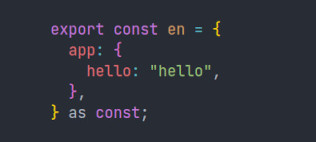
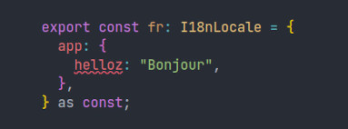
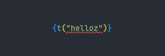
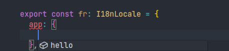
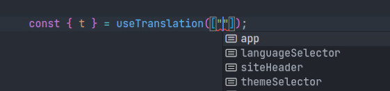

### Typesafe Translations with TypeScript and i18next

- One language is the "source of truth" for the types:

- A typo or a missing translation in another language is detected immediately:

- A typo in the code is also detected immediately:

- Intellisense is available in the translation files and in the code:

Test it at [zwyx.github.io/typesafe-translations](https://zwyx.github.io/typesafe-translations) – learn more at [zwyx.dev/blog/typesafe-translations](https://zwyx.dev/blog/typesafe-translations)

